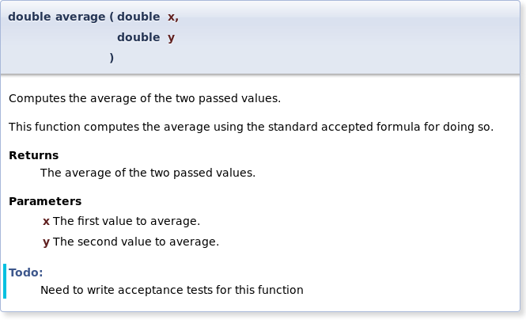

PDR: Doxygen Tutorial
=====================

[Go up to the Tutorials table of contents page](../index.html)

A Mac OS X note: doxygen on a Mac is very hard to install and configure.  It will likely be easier to run doxygen through VirtualBox.  But see the very last paragraph of this lab for Mac-specific details.

When writing large amounts of code, it is important to document it, both for your understanding later, as well as for other people's understanding (such as the graders).  So far, all of our documentation has been via regular comments.  However, there exist a number of documentation tools that allow us to do a lot more with our comments.  Consider the Java SDK source code.  If you look at the code itself, there are a lot of comments with special "tags" in the source code.  A tag is a special command that denotes the comment is about some specific aspect, such as the parameter type or return value.  The source code is then run through a program called javadoc (which comes with the Java SDK), and the full online HTML documentation pages that we are familiar with are then created.

Note that the current version of doxygen, as of the writing of this lab, is 1.8.6.  The version currently installing on Ubuntu Linux (both in the lab and on Virtual Box) may be an earlier version.  These differences should not make any difference for the tags we are using.

Javadoc is great for Java code, but does not work for C++ code.  Thus, we are going to use a program called doxygen, which works on a dozen different languages, including C++.  The homepage for doxygen is [here](http://www.doxygen.org).  A function might be commented as follows.  Note that the doxygen comments come *before* the code block to be documented.

```
/** @brief Computes the average of the two passed values.
 *
 * This function computes the average using the standard accepted
 * formula for doing so.
 * @return The average of the two passed values.
 * @param x The first value to average.
 * @param y The second value to average.
 * @todo Need to write acceptance tests for this function
 */

double average (double x, double y) {
  return (x+y)/2.0;
}
```

This is much more documentation than is probably necessary for the `average()` function, but the point is to show the functionality of doxygen.  Note that five of the lines have tags, such as `@return`, which means that the following comment is specifically about the return value.  Some tags, such as the `@param` tag, require a parameter.

Save the above code as a file called [average.cpp](average.cpp.html) ([src](average.cpp)), put the [Doxyfile](Doxyfile) in the same directory, and run doxygen via the `doxygen` command -- no command line parameters are needed (assuming the `Doxyfile` file is in the same directory, which it is in this case).  The provided configuration file produces documentation in two forms -- HTML and RTF.  With a modification to the configuration file (which we won't see here), it can produce documentation in other formats as well (LaTeX, man pages, XML, etc.).  

RTF (rich text format) is a file type that can be loaded up into your favorite word processing program.  One you have run doxygen, the comments are formatted into a file called doc/rtf/refman.rtf -- try loading up that file.  Note that a number of the fields in the file (such as "Title" and "Author") are not yet filled in -- this is addressed below.

The other version, and the one we are going to look at, is the HTML documentation.  After you run doxygen, these files are in the doc/html directory -- view the index.html file.  If you look at the documentation for this function (from the main page, follow the "Files"link and then the "average.cpp" link), the web page looks like the following:



Do you see how the tags are separated into the different parts of this comment block?  To create the documentation for your code, you will need to create the `Doxyfile` file.  Start with the one provided with this tutorial.  Note that it's a text file, even though it does not have a .txt extension -- thus, Emacs is a good editor to use to edit the file.  We won't get into most of the details of the file.  However, on line 577, you have to edit the INPUT parameter, which specifies which file(s) to read and produce documentation for.  Other fields will allow you to specify such things as the title, author, etc. (these are the things that were missing in the RTF file).

Next, look at the doxygen manual.  You can view it in PDF form, but you will first have to download that file (start [here](http://www.stack.nl/~dimitri/doxygen/download.html#dlmanual)).  Otherwise, you can view the [online HTML manual](http://www.stack.nl/~dimitri/doxygen/manual/index.html).  Start with the ["Documenting the code" chapter](http://www.stack.nl/~dimitri/doxygen/manual/docblocks.html), as the previous chapters were covered by the description above.

### Important Notes ###

Private members are not documented in Doxygen by default.  To change this (i.e. to document private members), you will want to change the `EXTRACT_PRIVATE` flag in Doxyfile to `YES`.

You may have to include all of your comments in your .h file.  This depends less on the doxygen version, and more on how you structure your code comments, but if you are making changes to your doxygen comments and are not seeing the results, try moving them to the .h file.  As long as the documentation is created when `doxygen` is run, we don't really care where your doxygen comments are in your source code.

To get doxygen working on the Mac, you will have to copy two binaries in /Applications/Doxgyen.app/Contents/Resources/ (or similar) to /usr/bin if you want to run it via the Makefile.

Alternatively, if you have [homebrew](http://brew.sh/) installed on your Mac, you can brew install doxygen from the command line with the command found [here](http://brewformulas.org/Doxygen).
